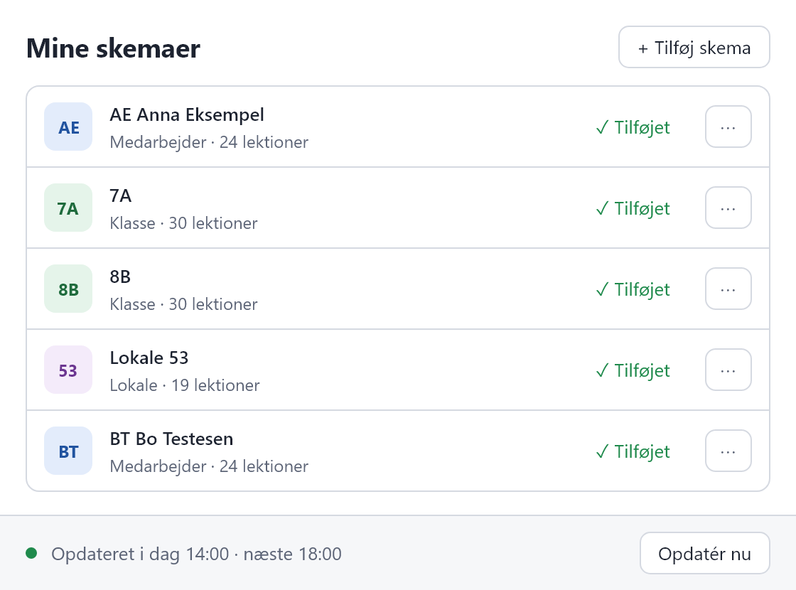
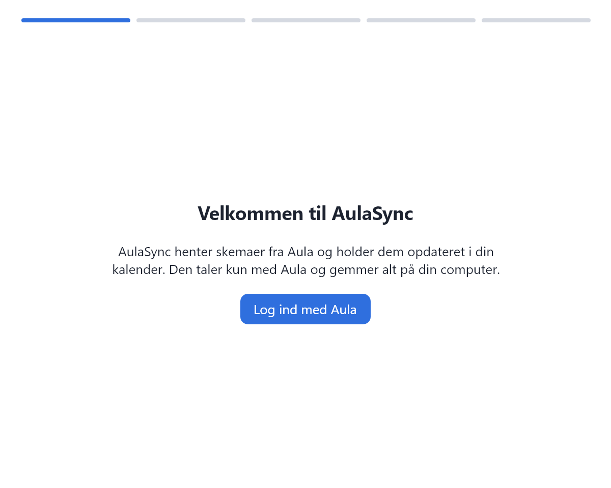
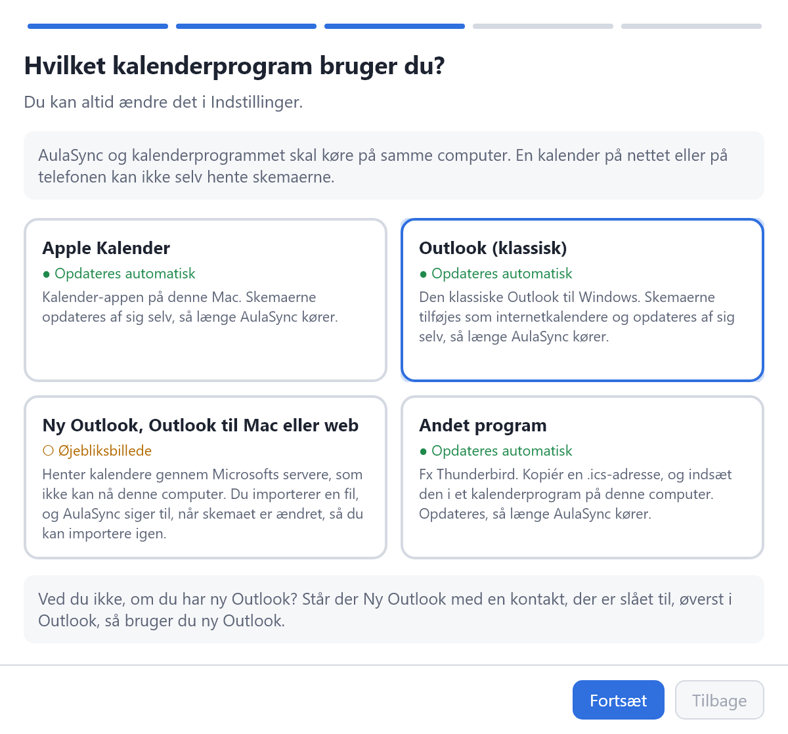
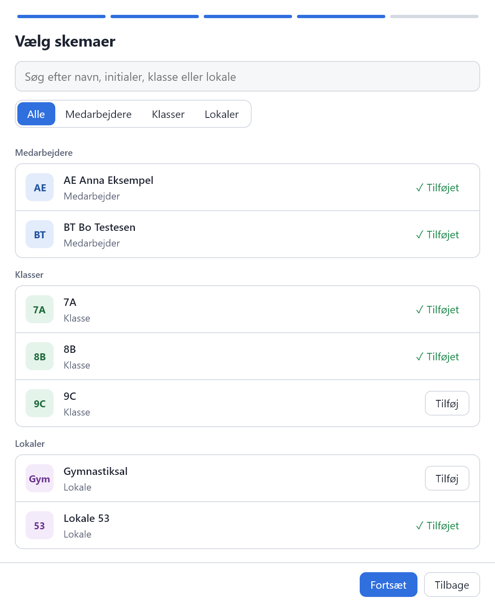
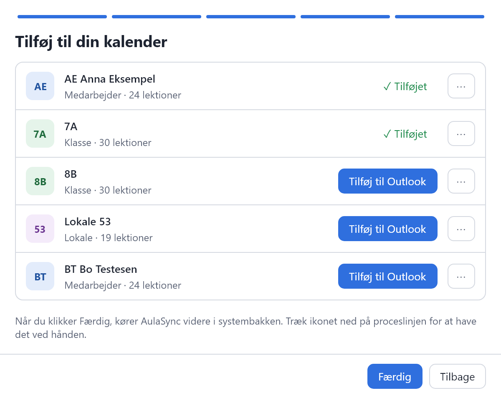

<p align="center"></p>

<h1 align="center">AulaSync</h1>

<p align="center"><b>Skemaerne fra Aula. Lige i din kalender.</b><br>
Skemaer for dig selv, dine kolleger, klasser og lokaler i din kalender. I Apple Kalender og klassisk Outlook opdaterer de sig selv.</p>

<p align="center"><b>Gratis</b> til Windows og Mac. Et uafhængigt projekt, der ikke er tilknyttet Aula, KOMBIT, Netcompany eller KMD.</p>

<p align="center">
<a href="https://github.com/rpaasch/AulaSync/releases/latest"></a>


<a href="LICENSE"></a>
</p>

<p align="center">
<a href="https://github.com/rpaasch/AulaSync/releases/latest/download/AulaSync-Setup.exe"><b>Hent til Windows</b></a> ·
<a href="#mac-macos-15-eller-nyere"><b>Hent til Mac</b></a> ·
<a href="https://rpaasch.github.io/AulaSync/"><b>Hjemmeside</b></a> ·
<a href="docs/vejledning.md"><b>Vejledning</b></a>
</p>

<p align="center"><picture>
<source media="(prefers-color-scheme: dark)" srcset="docs/billeder/mine-skemaer-windows-moerk.png">

</picture></p>

<p align="center"><sub>Skærmbillederne er fra Windows; på <a href="https://rpaasch.github.io/AulaSync/">hjemmesiden</a> kan du også se dem fra Mac. Navne, klasser og lokaler på dem er opdigtede.</sub></p>

## Til hvem

Til alle på skolen, der planlægger efter skemaet. Vælg medarbejdere, klasser og lokaler. Hvert skema bliver sin egen kalender, som du kan slå til og fra i dit kalenderprogram.

- **Skolesekretær og kontor:** Følg lokalerne og de kolleger, du planlægger for. Har en lektion fået vikar, står der `Vikar` først i titlen, og beskrivelsen viser, hvem vikaren dækker for.
- **Medarbejdere:** Lærere, pædagoger, inklusionsmedarbejdere og alle andre med et skema i Aula. Dine lektioner og dine klassers skemaer ved siden af møder og forældresamtaler. Titlen viser fag, lokale og klasse, som de står i Aula, fx `Dansk | Lokale 53 | 7A`.
- **Ledelse:** Medarbejdere, klasser og lokaler side om side, når du finder tid til møder, samtaler og arrangementer.

AulaSync henter ændringer fra Aula hver 4. time (i Indstillinger fra hver halve time til hver 8. time), så længe programmet kører. AulaSync taler kun med Aula og gemmer alt på din computer.

> **Kommer du fra 2.x?** Beskeder synkroniseres ikke længere, og indstillinger fra 2.x overføres ikke. Se [Opgradering fra 2.x](docs/vejledning.md#opgradering-fra-2x).

## Sådan virker det

<table>
<tr>
<td width="50%" valign="top"><b>1. Log ind</b><br>Log ind på Aula, som du plejer, med MitID, UniLogin eller din kommunes login.</td>
<td width="50%" valign="top"><b>2. Vælg kalenderprogram</b><br>Apple Kalender, Outlook eller et andet program. Du kan altid ændre det i Indstillinger.</td>
</tr>
<tr>
<td valign="top"><picture><source media="(prefers-color-scheme: dark)" srcset="docs/billeder/velkommen-windows-moerk.png"></picture></td>
<td valign="top"><picture><source media="(prefers-color-scheme: dark)" srcset="docs/billeder/kalenderprogram-windows-moerk.png"></picture></td>
</tr>
<tr>
<td valign="top"><b>3. Vælg skemaer</b><br>Søg på navn, initialer, klasse eller lokale. Dit eget skema er valgt på forhånd.</td>
<td valign="top"><b>4. Tilføj til kalenderen</b><br>Klik knappen ved hvert skema, fx <b>Tilføj til Outlook</b> eller <b>Tilføj til Kalender</b>.</td>
</tr>
<tr>
<td valign="top"><picture><source media="(prefers-color-scheme: dark)" srcset="docs/billeder/vaelg-skemaer-windows-moerk.png"></picture></td>
<td valign="top"><picture><source media="(prefers-color-scheme: dark)" srcset="docs/billeder/tilfoej-til-kalender-windows-moerk.png"></picture></td>
</tr>
</table>

Første gang guider AulaSync dig gennem fem korte trin. Bagefter kører AulaSync videre i menulinjen (Mac) eller systembakken (Windows) og starter selv, når du logger ind på computeren. Trinene kan vises igen med **Kom i gang igen…** under Hjælp i Indstillinger, hvor **Vejledning** også åbner [vejledningen](docs/vejledning.md).

## Kalenderprogrammer

| Kalenderprogram | Knappen i AulaSync | Opdateres |
|---|---|---|
| Apple Kalender (Mac) | **Tilføj til Kalender** | automatisk |
| Outlook (klassisk) på Windows | **Tilføj til Outlook** | automatisk |
| Ny Outlook, Outlook til Mac og Outlook på nettet | **Importér…** | ikke automatisk (øjebliksbillede); AulaSync siger til, når skemaet er ændret |
| Andet program på samme computer, fx Thunderbird | **Kopiér adresse** | automatisk |

**AulaSync og kalenderprogrammet skal køre på samme computer.** Kalenderprogrammet henter skemaerne fra AulaSync på `http://localhost:9876` (eller en af de næste porte, hvis 9876 var optaget ved første start), altså din egen computer. En kalender på nettet eller på telefonen kan ikke nå den. Det gælder også ny Outlook, Outlook til Mac og Outlook på nettet, som henter kalendere gennem Microsofts servere. Til dem importerer du i stedet skemaet som en fil med **Importér…**. I Apple Kalender skal abonnementet ligge **På min Mac**, ikke i iCloud.

## Installation

### Windows 10 og 11 (64-bit)

Hent [AulaSync-Setup.exe](https://github.com/rpaasch/AulaSync/releases/latest/download/AulaSync-Setup.exe), og åbn den. Klik **Installer**, og lad **Start AulaSync** være markeret, når du klikker **Færdig**. AulaSync installeres kun for dig, i `%LOCALAPPDATA%\Programs\AulaSync`, og kræver ingen administratorrettigheder. Bagefter ligger AulaSync i Start-menuen.

Programmet er ikke signeret: viser Windows "Windows beskyttede din pc", så vælg **Flere oplysninger** › **Kør alligevel**. Gør det kun med en `AulaSync-Setup.exe`, du selv har hentet fra udgivelsessiden. Mangler **Kør alligevel**, eller siger Windows, at programmet er blokeret, har computerens administrator lukket for programmer, der ikke er godkendt. Så spørg skolens IT.

Med winget: højreklik på Start-knappen, vælg **Terminal** (på Windows 10: **Windows PowerShell**), og skriv:

```
winget install rpaasch.AulaSync
```

AulaSync installeres, lægges i Start-menuen og åbner. En ny udgave kommer først i winget, når Microsoft har godkendt den.

<details>
<summary><b>Ny udgave, ældre udgaver og WebView2</b></summary>

**Ny udgave:** Hent og åbn AulaSync-Setup.exe igen. Kører AulaSync, lukkes den og startes igen bagefter. Med winget: højreklik på AulaSync-ikonet i systembakken ved uret, vælg **Afslut AulaSync**, skriv `winget upgrade rpaasch.AulaSync` i Terminal, og start AulaSync fra Start-menuen bagefter.

**Har du en ældre udgave:** Har du lagt `AulaSync.exe` i en mappe selv, så installér AulaSync-Setup.exe. Start ved login flytter med til den installerede AulaSync, og bagefter kan du slette den gamle `AulaSync.exe`. Har du AulaSync fra winget fra før 3.2, så opdatér med winget som beskrevet ovenfor. winget kan ikke skifte til installationsprogrammet, så du beholder udgaven uden installation; den ligger også i Start-menuen.

Login bruger Microsoft Edge WebView2 Runtime, som følger med Windows 11 og findes på de fleste computere med Windows 10. Mangler den, siger AulaSync til.

</details>

### Mac (macOS 15 eller nyere)

Hent `AulaSync-<version>-arm64.dmg` (Apple-chip, M1 og nyere) eller `AulaSync-<version>-x64.dmg` (Intel) fra [den nyeste udgave](https://github.com/rpaasch/AulaSync/releases/latest), åbn den, og træk AulaSync over i **Programmer**.

Åbn AulaSync fra **Programmer** (ikke fra `.dmg`-filen, ellers kan AulaSync ikke starte af sig selv, når du logger ind). AulaSync er signeret af udvikleren og undersøgt af Apple (notariseret), så første gang spørger macOS kun, om du vil åbne en app, der er hentet fra internettet. Klik **Åbn**.

Med [Homebrew](https://brew.sh): skriv `brew install --cask rpaasch/tap/aulasync` i Terminal. Homebrew henter den rigtige udgave til din Mac og lægger AulaSync i **Programmer**; første gang du åbner den, spørger macOS som ovenfor. Ny udgave: `brew upgrade --cask rpaasch/tap/aulasync`. Kører AulaSync, lukker Homebrew den og åbner den igen, og macOS spørger ikke igen.

## Data og privatliv

AulaSync gemmer alt på din egen computer. Din adgangskode gemmer AulaSync ikke. Du logger ind på Aulas egen login-side, og AulaSync gemmer cookies fra Aula og fra login-tjenesten (fx UniLogin eller din kommunes login) i en browserprofil. Så forbliver du logget ind, og AulaSync kan selv logge ind igen i baggrunden, så længe login-tjenesten husker dig.

Kalender-serveren tager kun imod forbindelser fra din egen computer (`127.0.0.1` og `::1`) og udleverer kun skemafilerne. En hjemmeside i din browser kan ikke læse dem. Serveren har ingen adgangskode, så andre programmer og andre brugere, der er logget ind på samme computer, kan hente skemaerne.

<details>
<summary><b>Filerne, porten, Log ud og afinstallation</b></summary>

Filerne ligger her:

| | |
|---|---|
| Windows | `%LOCALAPPDATA%\AulaSync` |
| Mac | `~/Library/Application Support/AulaSync` |

| Fil eller mappe | Indhold |
|---|---|
| `kalendere/` | Én `.ics`-fil pr. skema, fx `123456-AE-medarbejder-1001.ics`: institutionens nummer, medarbejderens initialer (eller navn, hvis Aula ikke har initialer) eller klassens eller lokalets navn, typen og skemaets Aula-id |
| `abonnementer.json` | De skemaer, du har valgt |
| `config.json` | Kalenderprogram, første start, kalender-serverens port, hvor tit skemaerne hentes, og om opdateringstiden vises i kalenderen |
| `aulasync.log` | Log. Indeholder bl.a. navne og initialer på de skemaer, du har valgt, deres Aula-id'er og din institutions nummer. Højst ca. 1 MB; ældre linjer flyttes til `aulasync.log.old` |
| `webview/` (Windows) | Login til Aula. Slettes, når du logger ud. Er mappen i brug, slettes cookies i stedet, næste gang AulaSync viser Aulas login |
| `webview-id.txt` (Mac) | Hvilket login-lager AulaSync bruger. Selve login gemmer macOS i AulaSyncs WebKit-data uden for mappen. Når du logger ud, skifter AulaSync til et nyt, tomt lager; det gamle bruges ikke igen |

Porten vælges ved første start: 9876 eller den første ledige op til 9899, så flere brugere på samme computer som regel kan køre AulaSync samtidig. Porten reserveres dog ikke: kørte en anden brugers AulaSync ikke, da du startede AulaSync første gang, kan I få samme port, og så kan kun én af jer ad gangen køre kalender-serveren.

**Log ud…** i Indstillinger glemmer dit login og sletter dine valgte skemaer, og første start vises igen. Kalenderfilerne bliver liggende, så kalenderne viser stadig de seneste skemaer, men de bliver ikke opdateret, før du vælger skemaerne igen.

**Afinstallér AulaSync…** i Indstillinger fjerner alt, AulaSync har gemt på computeren: programmet, start ved login, dit login, dine indstillinger, loggen og kalenderfilerne. På Windows også genvejen i Start-menuen og mappen fra AulaSync 2 (`%USERPROFILE%\.aulasync`); på Mac også AulaSyncs WebKit-data med login og cache, og AulaSync flyttes til papirkurven. Det samme sker, når du afinstallerer AulaSync på Windows fra **Indstillinger › Apps** (**Installerede apps**, på Windows 10 **Apps og funktioner**) eller med `winget uninstall rpaasch.AulaSync`. Har du AulaSync fra winget fra før 3.2, så brug **Afinstallér AulaSync…**; **Indstillinger › Apps** og `winget uninstall` sletter dér kun programmet. Knappen findes fra AulaSync 3.2. Har du AulaSync fra Homebrew, fjerner `brew uninstall --zap --cask aulasync` det samme, men flytter dit login og dine data til papirkurven i stedet for at slette dem; tøm den bagefter. Knappen får også Homebrew til at glemme AulaSync. Slet bagefter AulaSync-kalenderne i dit kalenderprogram; dem kan AulaSync ikke slette.

</details>

Importerer du et skema i ny Outlook, Outlook til Mac eller Outlook på nettet, ligger det bagefter også i din Outlook-konto hos Microsoft.

## Ansvarsfraskrivelse

AulaSync er et uafhængigt projekt med åben kildekode og er **ikke tilknyttet, godkendt af eller støttet af Aula, KOMBIT, Netcompany eller KMD**. Appen bruger Aulas interne API, som ikke er offentligt dokumenteret og kan ændre sig uden varsel, så AulaSync kan holde op med at virke fra den ene dag til den anden.

Kalenderne indeholder personoplysninger om dine kolleger: navne, initialer og hvem der er vikar for hvem. Følg din skoles og kommunes regler for, hvor de må ligge, også når du importerer dem i ny Outlook, Outlook til Mac eller Outlook på nettet, som gemmer dem hos Microsoft. Brug på eget ansvar.

## Fejl og forslag

Skriv under [Issues](https://github.com/rpaasch/AulaSync/issues) her på GitHub (kræver en gratis GitHub-konto), hvis du finder en fejl eller har et forslag. Vedhæft gerne de sidste linjer fra `aulasync.log` (Indstillinger › Fejlfinding › **Åbn log**). Alle kan læse et issue, så erstat først navne, initialer, din institutions nummer, Aula-id'erne og dit brugernavn i filstier med opdigtede værdier, fx `Anna Eksempel`. Filnavnene rummer også institutionens nummer, initialer eller navne og Aula-id'er, fx `123456-AE-medarbejder-1001.ics`; skriv dem fx som `1-XX-medarbejder-1.ics` (både nummer, initialer eller navn og id).

## Byg selv

Kræver [.NET 10 SDK](https://dotnet.microsoft.com/download/dotnet/10.0).

```
dotnet run --project src/AulaSync.App
dotnet test AulaSync.slnx
```

<details>
<summary><b>Udgivelser, hjemmesiden og billederne</b></summary>

En udgivelse laves af GitHub Actions (`.github/workflows/release.yml`), når et versionsmærke som `v3.2.0` pushes: installationsprogrammet til Windows (`AulaSync-Setup.exe`, Inno Setup), den løse `AulaSync.exe` (til den portable udgave i winget og til IT), Mac-dmg'er (signeret med Developer ID og notariseret, når Apple-hemmelighederne findes; ellers, fx i en fork, kun ad hoc-signeret) og winget-manifester (se `packaging/`). Homebrew-cask'en (`packaging/homebrew`) prøves af i samme kørsel og lægges i tap'en `rpaasch/homebrew-tap`, når AulaSync er udgivet. Ikonet tegnes af `packaging/icon/make-icons.py`.

Hjemmesiden er `docs/index.html` og vises med GitHub Pages fra mappen `docs`. Skærmbillederne af AulaSync i `docs/billeder` tegnes med opdigtede skemaer af `tests/AulaSync.App.Tests/Skaermbilleder.cs`. Appen skriver med styresystemets skrift, så de tegnes på Windows og Mac (`-windows`/`-mac`), fx af workflowet `.github/workflows/skaermbilleder.yml`, der lægger dem som artefakter. På en Mac eller Windows-pc:

```
AULASYNC_SKAERMBILLEDER=$PWD/docs/billeder dotnet test tests/AulaSync.App.Tests --filter Skaermbilleder
```

Forhåndsbilledet `social.png` til delte links laves af hjemmesiden med `node tests/site/billeder.js` (kræver Playwright med Chromium).

</details>

## Licens

MIT. Se [LICENSE](LICENSE). Skrifttyperne på hjemmesiden (Bricolage Grotesque og Schibsted Grotesk) er under SIL Open Font License; se `docs/fonts`.
